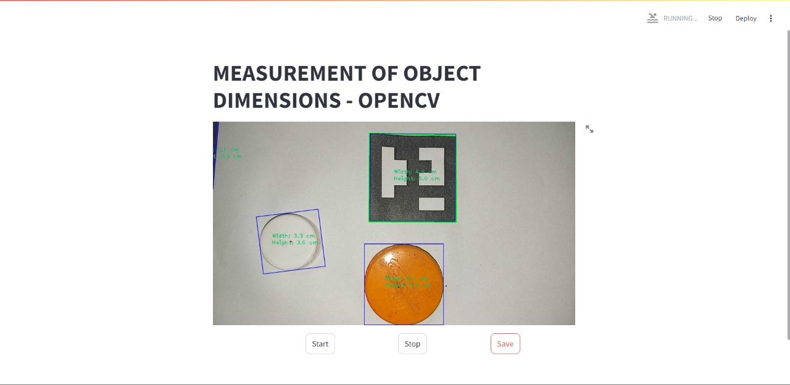
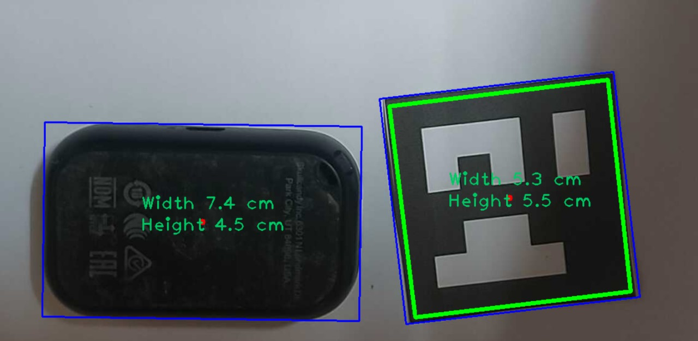

# Object Dimension Measurement using OpenCV

## Overview

The Object Dimension Measurement project utilizes OpenCV and Python to measure the dimensions of objects in an image or real-time video. This is useful for applications like quality control, automation, and object recognition.

## Features

Measures object dimensions using image processing techniques.

Uses a reference object for accurate scaling.

Supports real-time video analysis and static image processing.

Displays measurement results on the image.

## Output

